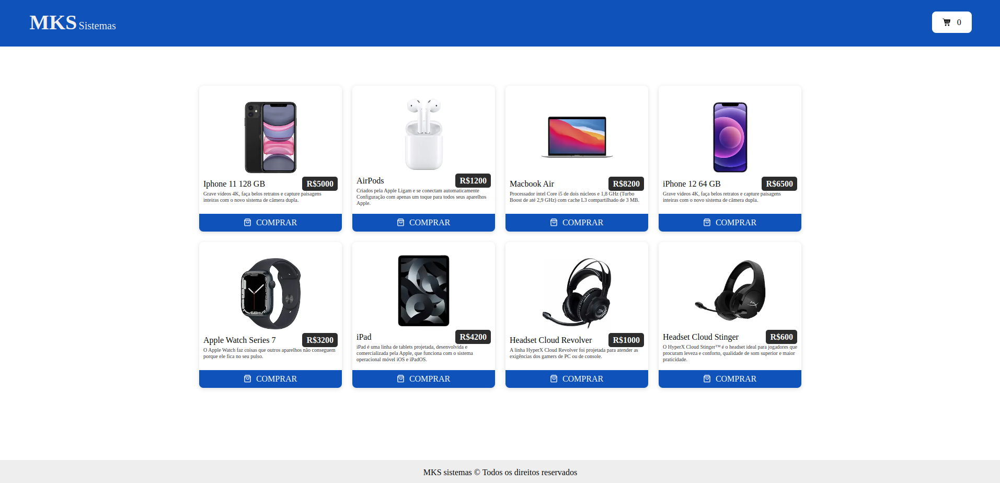

# Frontend Challenge



# Contexto

Aplicação frontend que simula um ecommerce de produtos tecnológicos com requisição a API externa, carrinho de compras e responsividade.

## Técnologias usadas

> Desenvolvido usando: Typescript, React, Next, Axios e Sass


## Rodando Aplicação

### Instalando Dependências

```bash
cd frontend-challenge/
npm install
``` 
### Executando aplicação

  ```
   npm run dev
  ```

Deploy rodando no link https://my-frontend-challenge.vercel.app/
